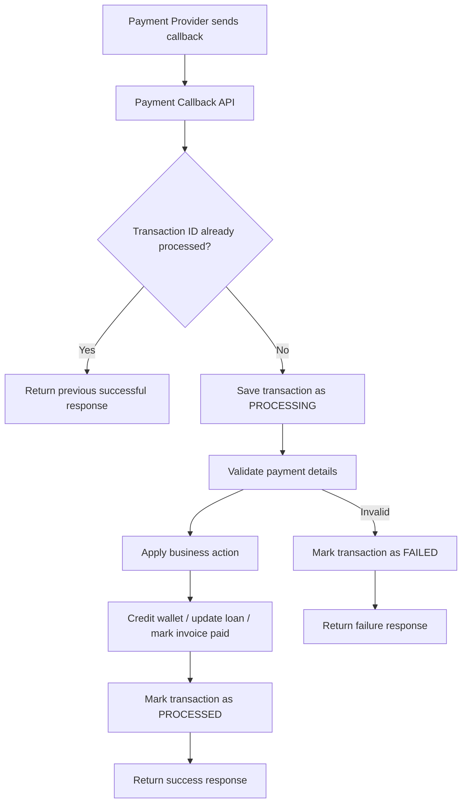

---

title: "Why Payment Systems Need Idempotency"
description: "A beginner-friendly architecture note on preventing duplicate payment processing using idempotency keys."
pubDatetime: 2026-06-10
tags: ["payments", "backend", "architecture", "spring-boot"]
draft: false
------------

Payment systems fail in boring but expensive ways.

A user can click **Pay** twice.
A mobile network can retry the same callback.
A payment provider can send the same notification multiple times.
Your API can time out even though the transaction succeeded.

Without idempotency, the same payment may be processed more than once.

## What is idempotency?

Idempotency means:

> The same request can be safely repeated multiple times, but the result should only happen once.

For example, if a customer pays KES 1,000, the system should credit the account once, even if the same payment callback is received three times.

## The problem

Imagine this payment callback arrives:

```json
{
  "transactionId": "MPESA123456",
  "accountNumber": "ACC001",
  "amount": 1000,
  "status": "SUCCESS"
}
```

If the provider sends it twice, a naive system may do this:

```txt
Callback 1 received → credit account KES 1,000
Callback 2 received → credit account KES 1,000 again
```

That is a serious financial bug.

## Correct flow

```txt
Payment Provider
       |
       v
Payment Callback API
       |
       v
Check idempotency key / transaction ID
       |
       +-----------------------------+
       |                             |
       v                             v
Already processed?              Not processed?
       |                             |
       v                             v
Return previous response         Save transaction as processing
                                     |
                                     v
                              Apply business action
                                     |
                                     v
                              Mark as processed
                                     |
                                     v
                              Return success response
```

## Mermaid flow diagram



## Basic database design

```sql
CREATE TABLE payment_callbacks (
    id BIGSERIAL PRIMARY KEY,
    transaction_id VARCHAR(100) NOT NULL UNIQUE,
    account_number VARCHAR(50) NOT NULL,
    amount NUMERIC(18, 2) NOT NULL,
    status VARCHAR(30) NOT NULL,
    processing_status VARCHAR(30) NOT NULL,
    raw_payload TEXT NOT NULL,
    created_at TIMESTAMP NOT NULL DEFAULT CURRENT_TIMESTAMP,
    updated_at TIMESTAMP NOT NULL DEFAULT CURRENT_TIMESTAMP
);
```

The important part is this:

```sql
transaction_id VARCHAR(100) NOT NULL UNIQUE
```

That unique constraint protects the system even if two duplicate requests arrive at almost the same time.

## Spring Boot example

### Request DTO

```java
public record PaymentCallbackRequest(
        String transactionId,
        String accountNumber,
        BigDecimal amount,
        String status
) {
}
```

### Entity

```java
import jakarta.persistence.*;
import java.math.BigDecimal;
import java.time.LocalDateTime;

@Entity
@Table(
    name = "payment_callbacks",
    uniqueConstraints = {
        @UniqueConstraint(name = "uk_payment_transaction_id", columnNames = "transaction_id")
    }
)
public class PaymentCallback {

    @Id
    @GeneratedValue(strategy = GenerationType.IDENTITY)
    private Long id;

    @Column(name = "transaction_id", nullable = false, unique = true)
    private String transactionId;

    @Column(name = "account_number", nullable = false)
    private String accountNumber;

    @Column(nullable = false)
    private BigDecimal amount;

    @Column(nullable = false)
    private String status;

    @Column(name = "processing_status", nullable = false)
    private String processingStatus;

    @Column(name = "raw_payload", nullable = false, columnDefinition = "TEXT")
    private String rawPayload;

    @Column(name = "created_at", nullable = false)
    private LocalDateTime createdAt = LocalDateTime.now();

    @Column(name = "updated_at", nullable = false)
    private LocalDateTime updatedAt = LocalDateTime.now();

    protected PaymentCallback() {
    }

    public PaymentCallback(
            String transactionId,
            String accountNumber,
            BigDecimal amount,
            String status,
            String processingStatus,
            String rawPayload
    ) {
        this.transactionId = transactionId;
        this.accountNumber = accountNumber;
        this.amount = amount;
        this.status = status;
        this.processingStatus = processingStatus;
        this.rawPayload = rawPayload;
    }

    public String getTransactionId() {
        return transactionId;
    }

    public String getProcessingStatus() {
        return processingStatus;
    }

    public void markProcessed() {
        this.processingStatus = "PROCESSED";
        this.updatedAt = LocalDateTime.now();
    }

    public void markFailed() {
        this.processingStatus = "FAILED";
        this.updatedAt = LocalDateTime.now();
    }
}
```

### Repository

```java
import org.springframework.data.jpa.repository.JpaRepository;

import java.util.Optional;

public interface PaymentCallbackRepository extends JpaRepository<PaymentCallback, Long> {

    Optional<PaymentCallback> findByTransactionId(String transactionId);

    boolean existsByTransactionId(String transactionId);
}
```

### Service

```java
import com.fasterxml.jackson.databind.ObjectMapper;
import org.springframework.dao.DataIntegrityViolationException;
import org.springframework.stereotype.Service;
import org.springframework.transaction.annotation.Transactional;

@Service
public class PaymentCallbackService {

    private final PaymentCallbackRepository repository;
    private final ObjectMapper objectMapper;

    public PaymentCallbackService(
            PaymentCallbackRepository repository,
            ObjectMapper objectMapper
    ) {
        this.repository = repository;
        this.objectMapper = objectMapper;
    }

    @Transactional
    public PaymentCallbackResponse process(PaymentCallbackRequest request) {
        return repository.findByTransactionId(request.transactionId())
                .map(existing -> new PaymentCallbackResponse(
                        existing.getTransactionId(),
                        existing.getProcessingStatus(),
                        "Duplicate callback ignored"
                ))
                .orElseGet(() -> processNewCallback(request));
    }

    private PaymentCallbackResponse processNewCallback(PaymentCallbackRequest request) {
        try {
            String rawPayload = objectMapper.writeValueAsString(request);

            PaymentCallback callback = new PaymentCallback(
                    request.transactionId(),
                    request.accountNumber(),
                    request.amount(),
                    request.status(),
                    "PROCESSING",
                    rawPayload
            );

            repository.save(callback);

            if (!"SUCCESS".equalsIgnoreCase(request.status())) {
                callback.markFailed();
                return new PaymentCallbackResponse(
                        request.transactionId(),
                        "FAILED",
                        "Payment was not successful"
                );
            }

            // Business action happens here:
            // - credit wallet
            // - update loan repayment
            // - mark invoice as paid
            // - publish event to Kafka/RabbitMQ

            callback.markProcessed();

            return new PaymentCallbackResponse(
                    request.transactionId(),
                    "PROCESSED",
                    "Payment processed successfully"
            );

        } catch (DataIntegrityViolationException duplicateRequest) {
            return new PaymentCallbackResponse(
                    request.transactionId(),
                    "PROCESSED",
                    "Duplicate callback ignored"
            );
        } catch (Exception exception) {
            throw new RuntimeException("Failed to process payment callback", exception);
        }
    }
}
```

### Response DTO

```java
public record PaymentCallbackResponse(
        String transactionId,
        String status,
        String message
) {
}
```

### Controller

```java
import org.springframework.http.ResponseEntity;
import org.springframework.web.bind.annotation.*;

@RestController
@RequestMapping("/api/v1/payments")
public class PaymentCallbackController {

    private final PaymentCallbackService service;

    public PaymentCallbackController(PaymentCallbackService service) {
        this.service = service;
    }

    @PostMapping("/callback")
    public ResponseEntity<PaymentCallbackResponse> receiveCallback(
            @RequestBody PaymentCallbackRequest request
    ) {
        PaymentCallbackResponse response = service.process(request);
        return ResponseEntity.ok(response);
    }
}
```

## Why the database constraint matters

Checking first in code is not enough.

This looks safe:

```java
if (!repository.existsByTransactionId(transactionId)) {
    repository.save(callback);
}
```

But two requests can arrive at the same time:

```txt
Request A checks → transaction does not exist
Request B checks → transaction does not exist
Request A saves
Request B saves
```

That is called a race condition.

The database unique constraint is the final protection.

## Better production design

For a real payment system, I would improve this with:

```txt
1. Unique transaction reference
2. Request signature verification
3. Raw payload storage
4. Processing status tracking
5. Retry-safe business logic
6. Dead letter queue for failures
7. Audit logs
8. Reconciliation reports
9. Alerting for suspicious duplicates
```

## Final architecture

```txt
Provider Callback
       |
       v
API Gateway / Controller
       |
       v
Signature Verification
       |
       v
Idempotency Check
       |
       v
Store Raw Callback
       |
       v
Business Processing
       |
       +------------------+
       |                  |
       v                  v
Success              Failure
       |                  |
       v                  v
Mark Processed       Mark Failed / Send to DLQ
       |
       v
Return 200 OK
```

## Key lesson

In payment systems, retries are normal.

The goal is not to prevent retries.

The goal is to make retries safe.

That is why idempotency is one of the most important backend patterns in fintech systems.
